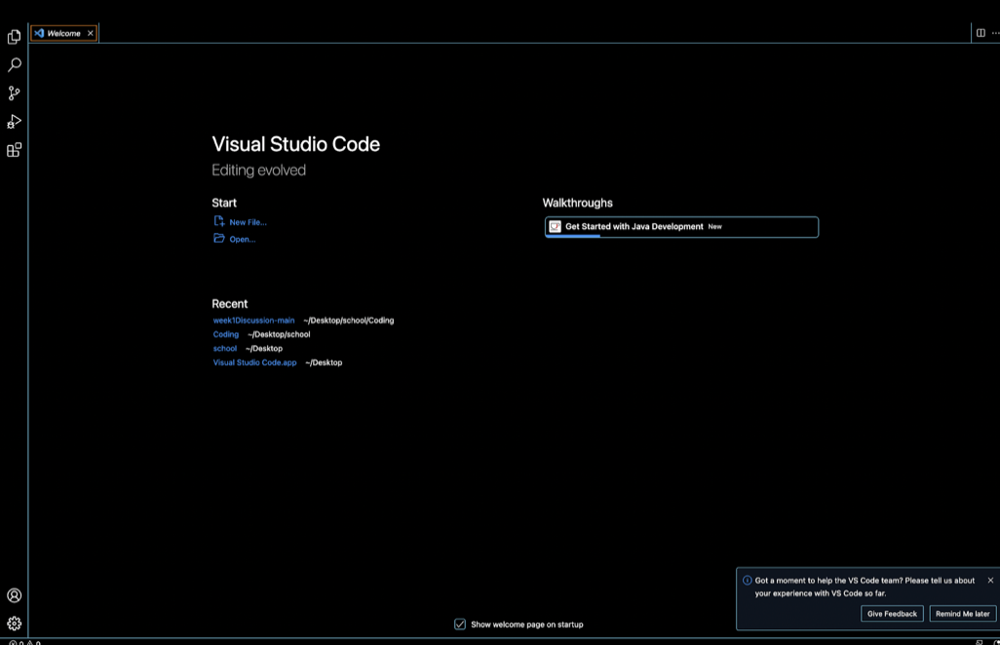

# Lab 1 Report

Installing VS Code:
Go to [Link](https://code.visualstudio.com/) to begin the installation process.
Once on the link download the appropriate link for Mac or Windows.

Remotely Connecting:
If you have Windows install Git and put it into VS code, if you have MAC you don't have to do anything. 
Open up terminal in VS code and input this: $ ssh cs15lsp23zz@ieng6.ucsd.edu. 
Make sure you don't include $, it is only for convention and replzce the zz with your specific account letters.
You will get a message saying, "The authenticity of host..." type yes and then enter your password.
You will know it worked if it "Last login:.." appears with some more text.

Trying Commands:
Run the commands cd, ls, pwd, mkdir, and cp in some different ways and observe what they do.
Those are the basic ones, some other you try are ls -lat, ls -a, and `cd ~`.
ls ~lat lists files and directories, including hidden ones.
ls -a lists files and directories alphabetically , including hidden ones, lists output in default format.
cd ~ changes the current working directory to the user's home directory

